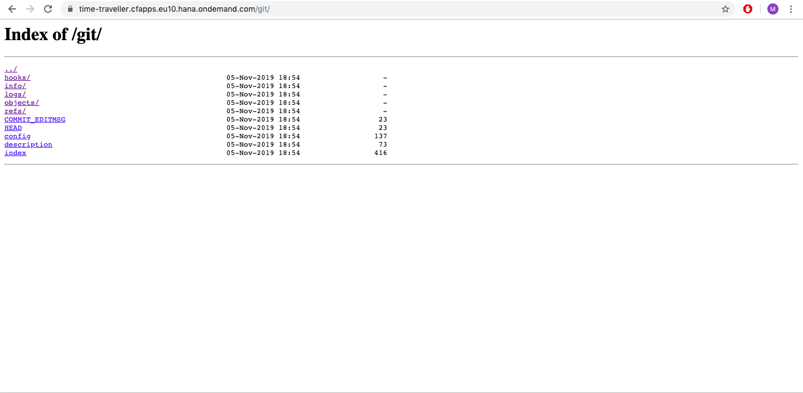
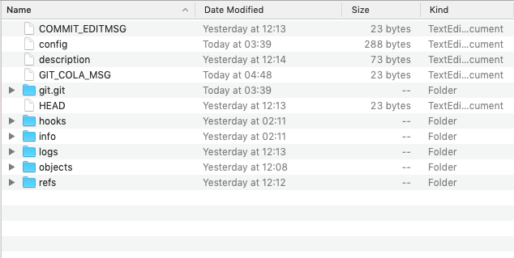
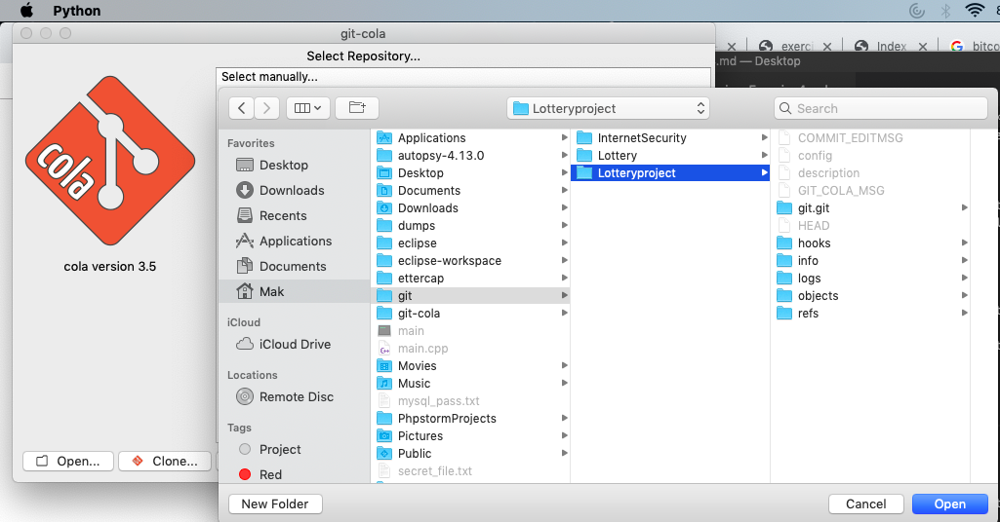
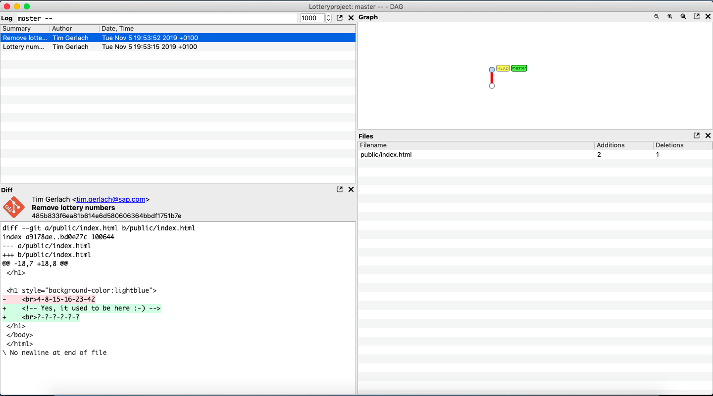
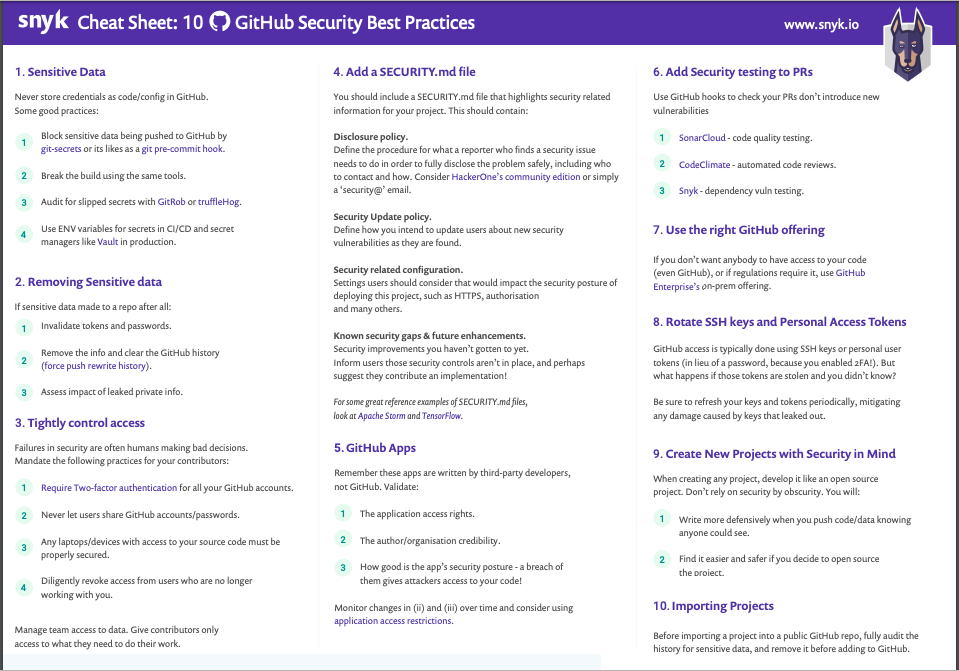

# Exercise 4
## 1. Find out the lottery numbers that used to be in index.html and explain the steps you performed to reveal them.
- As the website is hosted on git, we just added a '/git' at the end of the website to reveal its `/git` folder.



- As the whole .git folder is exposed we can clone this repository from github.
- So we downloaded and replicated the whole repository so that we can initialize the whole website.
- We manually downloaded the whole repository files, but there are tools available on the internet that will help download the whole repository from the URL. e.g - Using `wget` command in linux to donwload the repo.

 

- To read the files we installed GIT-DAG from GIT-COLA.
- The URL for the DAG tool - https://git-cola.github.io/
- Following the install instructions for mac os given on the page -
.png)
- After the 'Git-Cola' DAG has been installed we can run to initialize the git code.
- Open the Git-Cola DAG.
- Now we select the directory containing the index files, point to the directory and load it.

- switch to 'DAG' View in 'VIEW' option.

- There we can see lottery numbers in the last commit of the master file that was exposed in .git of the website.

## 2. What are your advises to developers to prevent such a hack from happening in the future.

- The `/git` folder of any repository on Github contain the source code, metadata, version, commit history and other sensitive information.
- The solution to prevent such hacks from happening again is to ensure `/git` folder is not exposed to the web, even if there is no sensitive information in these files.
- Moving `/git` directory outside of the root. 
- Servers have settings restrict public acceess like if server is : 
    
    Apache.
    including this line in config file-
    `RedirectMatch 404 /\\.(svn|git|hg|bzr|cvs)(/|$)`

    For IIS.
    
    ```
    <configuration>
    <system.webServer>
    <security>
    <requestFiltering>
    <hiddenSegments>
    <add segment=”.git” />
    <add segment=”.svn” />
    </hiddenSegments>
    </requestFiltering>
    </security>
    </system.webServer>
    </configuration>
    ```

- Managing team access by only allowing contributers access the required data.
- Credentials should never be stored in github/index files.
- If any credentials were public, invalidate any passwords or tokens.Remove the sensitive data. For purging the github history properly following steps given by Github https://help.github.com/en/github/authenticating-to-github/removing-sensitive-data-from-a-repository 
- The developer can follow the steps mentioned in the cheatsheet.


Image Reference - 
https://res.cloudinary.com/snyk/image/upload/v1535626770/blog/10_GitHub_Security_Best_Practices_cheat_sheet.pdf

References - 

1.https://blog.hivint.com/exposed-git-repos-on-the-ipv4-address-space-61cf8838e424

2.https://snyk.io/blog/ten-git-hub-security-best-practices/